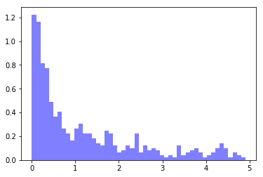
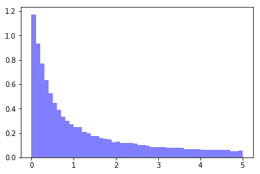

---
output:
  pdf_document: default
  html_document: default
---

Because $p(x|y) \propto ye^{-yx}$, $0<x<B<\infty$, we can write $p(x|y)=a \times ye^{-yx}$. 

We know $ 0 < x < B $, we get $a = \frac {1}  {\int_0^B \! f(x) \, \mathrm{d}x} = \frac {1} {1-e^{-By}}$.

Now we can write $p(x|y) = \frac {ye^{-yx}} {1-e^{-By}} $; similarly, $p(y|x) = \frac {xe^{-yx}} {1-e^{-Bx}} $

To use the inversion sampling, we need to first drawn a random variable $u~U(0,1)$ and then inverting this draw using $F^{-1}$.

Therefore, we calculate $F(x|y) = \int_0^x f(x|y)dx = \frac {1-e^{-yx}} {1-e^{-By}}$. 

Let $u = F(z)$

$z = F^{-1}(u) = \frac {\log{(1- u \times (1-e^{-yB}))}} {-y}$

Given a draw of u and y, z is a draw from $p(x|y)$. The same can be done for $p(y|x)$ and we obtain that the function is
$ \frac {\log{(1- u \times (1-e^{-xB}))}} {-x}$ for drawing from the $p(y|x)$.

We first choose an initial value for x and y as x0, y0 respectively within the range of 0 to B. Then, we generate a $u$ from the Uniform distribution [0,1], plug the value of u and y0 into the inversed function and get an updated x. Similarly, we will update y accordingly. Repeating the steps will generate a series of x and y's which forms our new distribution. 

See the code below:


```python
import numpy as np
import matplotlib.pyplot as plt
def gibbs(x0,y0,B,n):
    #setting empty arrays for storing values later
    x = np.empty(n)
    y = np.empty(n)
    #a is simply a matrix form of x,y
    a = np.empty([n,2])
    #take x0, y0 as initial values for x, y
    x[0] = x0
    y[0] = y0
    a[0] = (x0,y0)
    for i in range(1,n):
        #sample from f(x|y) using inversion method
        #u1 is a random number generated from the uniform distribution
        u1 = np.random.uniform(0,1)
        x[i] = np.log(1-u1*(1-np.exp(-y[i-1]*B)))/(-y[i-1])
        #sample from f(y|x) using inversion method
        #u2 is a random number generated from the uniform distribution
        u2 = np.random.uniform(0,1)
        y[i] = np.log(1-u2*(1-np.exp(-x[i]*B)))/(-x[i])
        #output the matrix formed by x and y
        a[i] = (x[i],y[i])
    return a
```

Now, by choosing x=1, y=1 as starting point, B=5, and 500, 5000, 50000 as the number of iterations, we obtain matrices a1, a2, a3 which stored all values of x and y's we generated from each condition. Use matplotlib.pyplot package to plot the histograms below. As we can see, the more iterations we have done, the smoother the histogram. I think the values of x, y fluctuates the most at the beginning of the processes, but stablizes after it runs repeatedly. Therefore, if I have thrown out the first n x,y pairs we got, the estimation may even be better (built a burnIn part which throw out 0.1n numbers of the beginning iterations for example). But I choose not to do it here, to just maintain the full distribution of all 500 iterations. 


```python
#histogram of X
#Since B is 5, choose a number from 0 to 5 as a starting point
a1 = gibbs(1,1,5,500)
a2 = gibbs(1,1,5,5000)
a3 = gibbs(1,1,5,50000)
plt.hist(a1[:,[1]], 50, normed=1, facecolor='blue', alpha=0.5)
plt.show()
plt.hist(a2[:,[1]], 50, normed=1, facecolor='blue', alpha=0.5)
plt.show()
plt.hist(a3[:,[1]], 50, normed=1, facecolor='blue', alpha=0.5)
plt.show()
```








As we can see below, the means the x's generated by different sample sizes are close together but much closer between 500 and 5000 iterations. I use the mean for 50000 samples to estimate E(x) = 1.26


```python
np.mean(a1[:,[1]])
```


    1.1905003657315947


```python
np.mean(a2[:,[1]])
```


    1.2721319566586644


```python
np.mean(a3[:,[1]])
```


    1.2562601478846753


